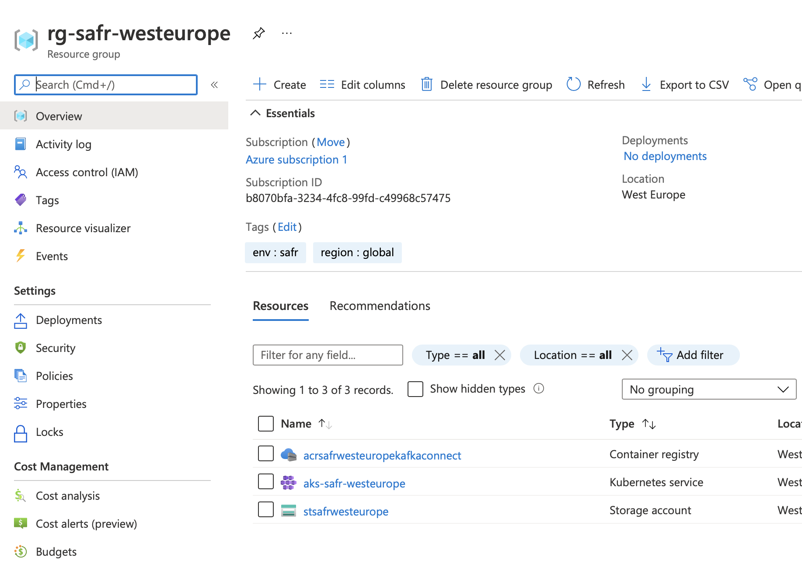
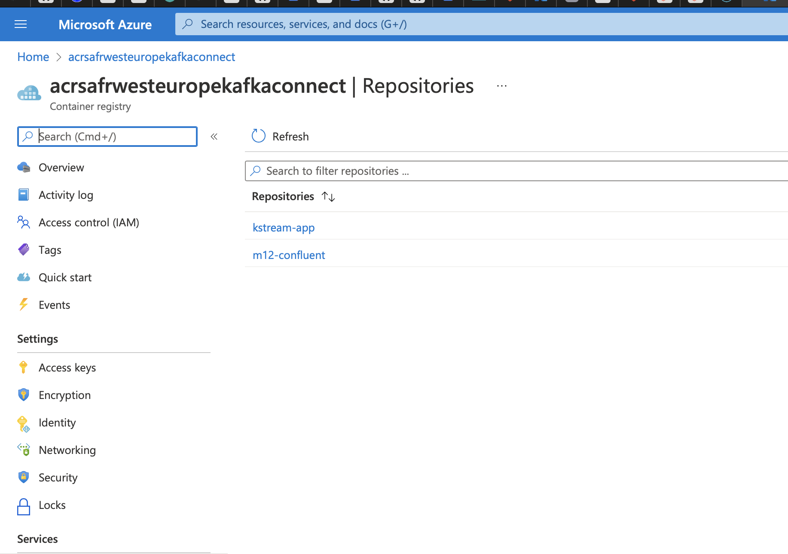
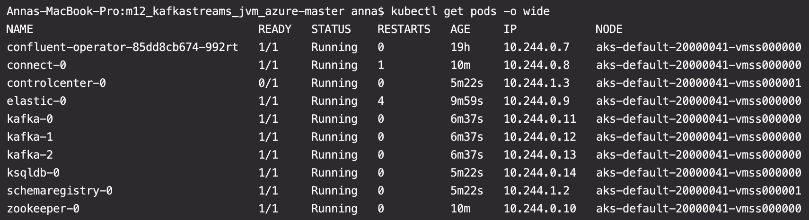
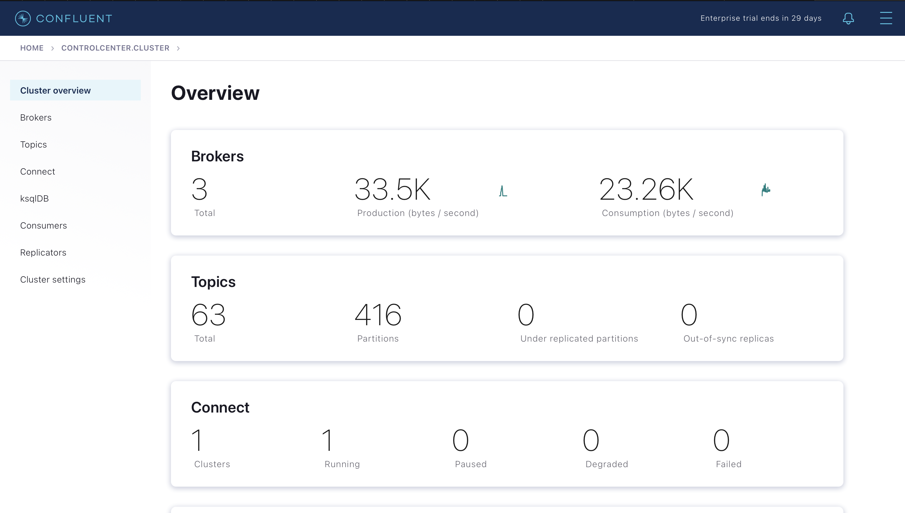
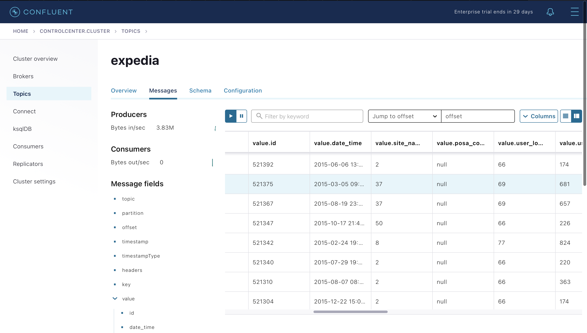
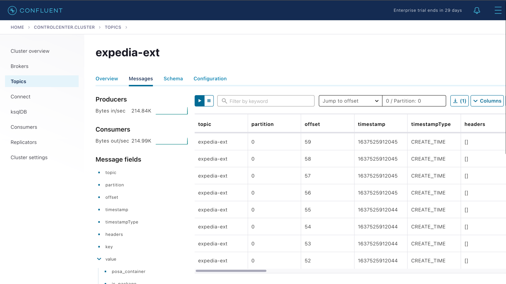
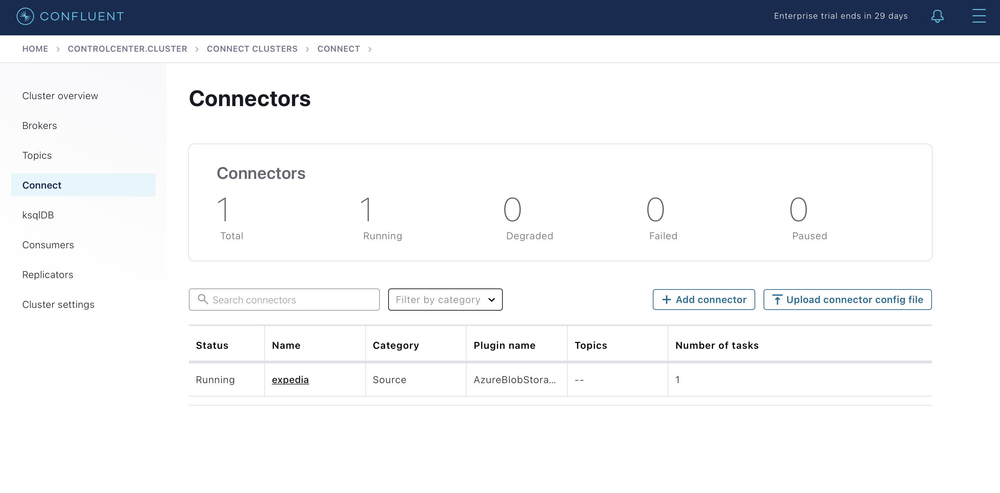
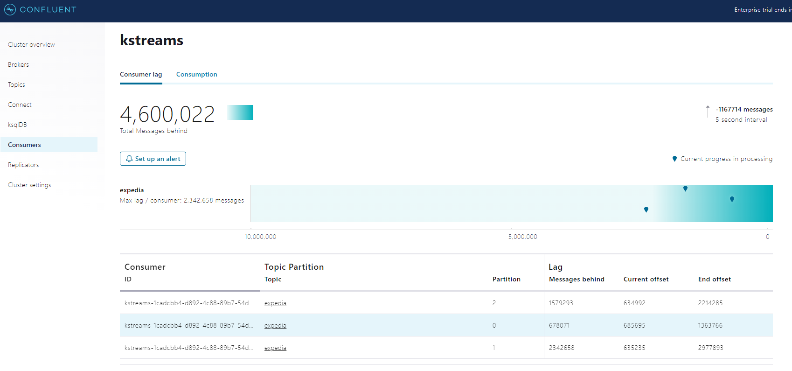

# Kafka Streams Homework 
 
1. Deploy Azure resources using Terraform
 ```
 terraform init
 terraform plan -out terraform.plan
 terraform apply terraform.plan
 ....
 terraform destroy
 ```


  
2. Configure kubectl to connect to the AKS cluster: 

  ```
az aks get-credentials -g <resource group name> -n <cluster name> 
  ```

3. Prepare Azure Container Registry to store Docker images: 

  ```
az acr create -n <registry name> -g <resource group name> --sku basic 
  ```

4. Attach created ACR to the AKS cluster: 

  ```
az aks update -n <cluster name> -g <resource group name> --attach-acr <registry name> 
  ```

5. Build a Docker image for connector and push it to ACR: 

  ```
az acr login -n <registry name> 
docker build -f connectors/Dockerfile -t <registry name>.azurecr.io/<image name>:<tag> . 
docker push <registry name>.azurecr.io/<image name>:<tag> 
  ```


6. Create the namespace to use: 

  ```
kubectl create namespace confluent 
 ```

7. Set this namespace to default for your Kubernetes context:

 ```
kubectl config set-context --current --namespace confluent 
  ```
7. Add the Confluent for Kubernetes Helm repository:
 
 ```
helm repo add confluentinc https://packages.confluent.io/helm 
helm repo update 
```

8. Install Confluent for Kubernetes:

```
helm upgrade --install confluent-operator confluentinc/confluent-for-kubernetes
``` 

9. Install all Confluent Platform components:

 ```
kubectl apply -f ./confluent-platform.yaml 
```

10. Install a sample producer app and topic:

```
kubectl apply -f ./producer-app-data.yaml
```
11. Check that everything is deployed:

  ```cmd
  kubectl get pods -o wide 
  ```


12. View Control Center

- Set up port forwarding to Control Center web UI from local machine:

  ```cmd
  kubectl port-forward controlcenter-0 9021:9021
  ```


13. Create Kafka topics expedia and expedia-ext: 

 ```
kubectl exec kafka-0 -c kafka -- bash -c "/usr/bin/kafka-topics --create --topic <topic name> --replication-factor 3 --partitions 3 --bootstrap-server localhost:9092" 
 ```



14. Prepare the Azure source connector configuration and upload the configuration file: 
 
 ```
kubectl port-forward connect-0 8083:8083 
curl -s -X POST -H 'Content-Type: application/json' -d @connectors/azure-source-cc-expedia.json http://localhost:8083/connectors 
 ```

 
* azure-source-cc-expedia.json
```
{
  "name": "expedia",
  "config": {
    "connector.class": "io.confluent.connect.azure.blob.storage.AzureBlobStorageSourceConnector",
    "azblob.account.name": "bd201stacc",
    "azblob.account.key": "L6X661FhSG78rVrWUyNOTzeXyzfHzQVZF9bX0ukUS4U90VQdLTeuEVWUFiok8l4MAXJGMLYIolTT1R1rjuNtrA==",
    "azblob.container.name": "m12kafkastreams",
    "format.class": "io.confluent.connect.azure.blob.storage.format.avro.AvroFormat",
    "confluent.topic.bootstrap.servers": "kafka:9092",
    "tasks.max": "1"
  }
}
```

15. Build KStream application jar, then build a Docker image and push it to ACR. 

 ```
mvn package 
docker build -t <registry name>.azurecr.io/kstream-app:1.0 . 
docker push <registry name>.azurecr.io/kstream-app:1.0 
 ```
 
16. Run the KStream app container in the K8s cluster. 

 ```
kubectl apply -f ./kstream-app.yaml 
 ```
 
 
17. Visualized data in Kafka topic (expedia_ext) with KSQL. Show total amount of hotels (hotel_id) and number of distinct hotels (hotel_id) for each category.
  
Create stream and table:  
 
* Stream for visualizing data from expedia-ext topic: 
```
CREATE STREAM EXPEDIA_STREAM (CATEGORY VARCHAR, HOTEL_ID BIGINT) 
WITH (KAFKA_TOPIC='expedia-ext', VALUE_FORMAT='JSON'); 
 ```
* Table that shows total and distinct number of hotels for each category: 
 ```
CREATE TABLE EXPEDIA_TABLE AS SELECT 
CATEGORY, COUNT(HOTEL_ID) AS TOTAL_HOTELS, COUNT_DISTINCT(HOTEL_ID) AS DISTINCT_HOTELS 
FROM EXPEDIA_STREAM GROUP BY CATEGORY EMIT CHANGES; 
  ```
* Select from the resulting table: 
  ```shell
ksql> SELECT * FROM EXPEDIA_TABLE WHERE CATEGORY IN ('Short stay', 'Standard stay', 'Standard extended stay', 'Long stay', 'Erroneous data'); 

+----------------------------+------------------+----------------+ 
|CATEGORY                    |TOTAL_HOTELS      |DISTINCT_HOTELS | 
+----------------------------+------------------+----------------+ 
|Short stay                  |1065918           |2486            | 
|Standard stay               |252741            |2486            | 
|Long stay                   |5924              |2247            | 
|Standard extended stay      |13746             |2464            | 
|Erroneous data              |4019              |1994            | 

 ```
